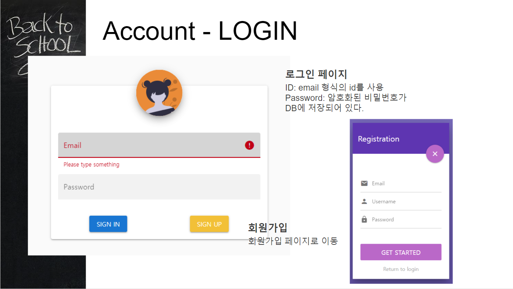
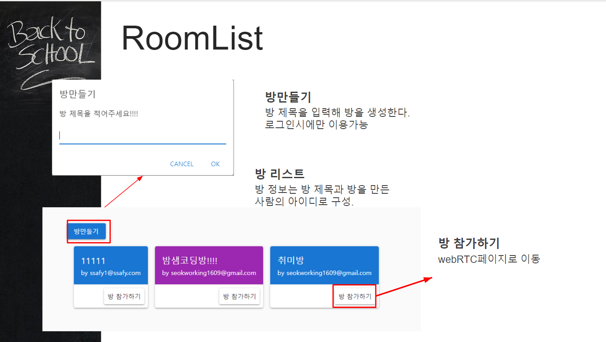
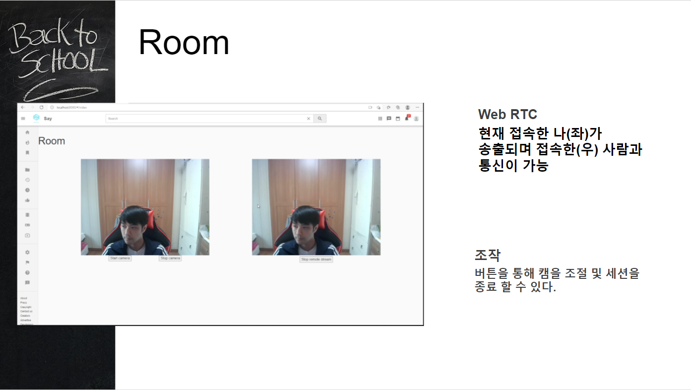
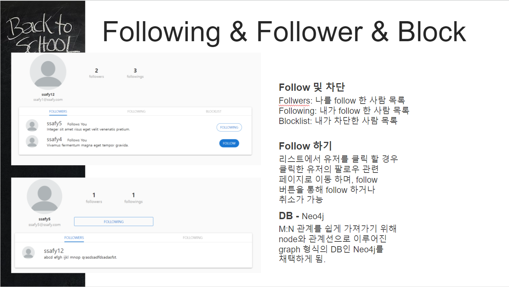
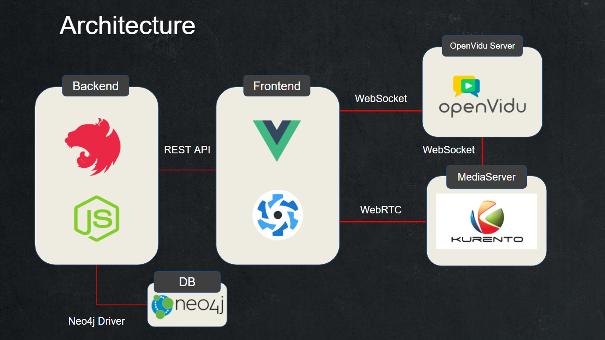

# 웹 RTC 프로젝트

<!-- 필수 항목 -->

## 카테고리

| Application                       | Domain                                | Language                      | Framework                               |
| --------------------------------- | ------------------------------------- | ----------------------------- | --------------------------------------- |
| :white_check_mark: Desktop Web    | :black_square_button: AI              | :white_check_mark: JavaScript | :white_check_mark: Vue.js               |
| :white_check_mark: Mobile Web     | :black_square_button: Big Data        | :white_check_mark: TypeScript | :black_square_button: React             |
| :white_check_mark: Responsive Web | :black_square_button: Blockchain      | :black_square_button: C/C++   | :black_square_button: Angular           |
| :black_square_button: Android App | :black_square_button: IoT             | :black_square_button: C#      | :white_check_mark: Nest.js              |
| :black_square_button: iOS App     | :black_square_button: AR/VR/Metaverse | :black_square_button: Python  | :white_check_mark: Quasar               |
| :black_square_button: Desktop App | :black_square_button: Game            | :black_square_button: Java    | :black_square_button: Spring/Springboot |
|                                   | :white_check_mark: WebRTC             | :black_square_button: Kotlin  | :white_check_mark: OpenVidu             |

<!-- 필수 항목 -->

## 프로젝트 소개

- 프로젝트명: 커뮤니티 음성대화 및 영상공유 서비스

- 서비스 특징: 간단하게 참여할 수 있는 주제별 대화 서비스

- 주요 기능
  - 회원 관리

  

  

  - 화상 및 음성 미팅룸

  

  - 채팅

  

  - 그룹 채팅

  

  - 팔로우 / 차단
  
  
  
- 주요 기술
  - WebRTC
  - WebSocket
  - JWT Authentication
  - REST API

- 참조 리소스
  - Vuetify : 디자인 전반 적용
  - Vue Script, Vue.js Examples : 각종 컴포넌트 활용
  - Nicepage : View 디자인

- 배포 환경
  - URL: 마지막에
  - 테스트 계정: 구글로그인하세요

<!-- 자유 양식 -->

## 팀 소개


<!-- 자유 양식 -->

## 프로젝트 상세 설명

// 개발 환경, 기술 스택, 시스템 구성도, ERD, 기능 상세 설명 등

개발환경 : Window, Mac

배포환경 : Linux Docker Container

### ERD

[ERD](https://www.erdcloud.com/d/5dCWbjJ5u3aWtLEPr)

### Architecture




# Frontend

### Quasar App (front-end)

A Quasar Framework app

### Install the dependencies

```bash
npm install
```

### Start the app in development mode (hot-code reloading, error reporting, etc.)

```bash
quasar dev
```

### Lint the files

```bash
npm run lint
```

### Format the files

```bash
npm run format
```

### Build the app for production

```bash
quasar build
```

### Customize the configuration

See [Configuring quasar.conf.js](https://quasar.dev/quasar-cli/quasar-conf-js).


# Backend

<p align="center">
  <a href="http://nestjs.com/" target="blank"></a>
</p>

[circleci-image]: https://img.shields.io/circleci/build/github/nestjs/nest/master?token=abc123def456
[circleci-url]: https://circleci.com/gh/nestjs/nest

  <p align="center">A progressive <a href="http://nodejs.org" target="_blank">Node.js</a> framework for building efficient and scalable server-side applications.</p>
    <p align="center">
<a href="https://www.npmjs.com/~nestjscore" target="_blank"></a>
<a href="https://www.npmjs.com/~nestjscore" target="_blank"></a>
<a href="https://www.npmjs.com/~nestjscore" target="_blank"></a>
<a href="https://circleci.com/gh/nestjs/nest" target="_blank"></a>
<a href="https://coveralls.io/github/nestjs/nest?branch=master" target="_blank"></a>
<a href="https://discord.gg/G7Qnnhy" target="_blank"></a>
<a href="https://opencollective.com/nest#backer" target="_blank"></a>
<a href="https://opencollective.com/nest#sponsor" target="_blank"></a>
  <a href="https://paypal.me/kamilmysliwiec" target="_blank"></a>
    <a href="https://opencollective.com/nest#sponsor"  target="_blank"></a>
  <a href="https://twitter.com/nestframework" target="_blank"></a>
</p>
  <!--[](https://opencollective.com/nest#backer)
  [](https://opencollective.com/nest#sponsor)-->

### Description

[Nest](https://github.com/nestjs/nest) framework TypeScript starter repository.

### Installation

```bash
$ npm install
```

### Running the app

```bash
# development
$ npm run start

# watch mode
$ npm run start:dev

# production mode
$ npm run start:prod
```

### Test

```bash
# unit tests
$ npm run test

# e2e tests
$ npm run test:e2e

# test coverage
$ npm run test:cov
```

### Support

Nest is an MIT-licensed open source project. It can grow thanks to the sponsors and support by the amazing backers. If you'd like to join them, please [read more here](https://docs.nestjs.com/support).

### Stay in touch

- Author - [Kamil Myśliwiec](https://kamilmysliwiec.com)
- Website - [https://nestjs.com](https://nestjs.com/)
- Twitter - [@nestframework](https://twitter.com/nestframework)

### License

Nest is [MIT licensed](LICENSE).

### Directory Summary

- main.ts : 루트 파일. 여기에 모든걸 import 하고 실행한다
- app.module : 개발에 사용된 모듈을 담는 파일
- controllers : service 를 import 하고 매핑된 url 에 따라 함수를 정의하고 service 계층의 핵심 로직을 실행시킨다
- services : repository (Database 계층) 를 import 하고 로직에 따라 repository 의 쿼리를 실행시킨다
- repository : DB 연결 및 CRUD 를 담당한다
- models : 필요한 DTO 및 DAO 를 정의한다

### DB Table Sync

```bash
yarn typeorm schema:sync
```

### Swagger-UI

http://localhost:3000/api/
